<!--
  This is the PROFILE README for github.com/Akshatr08. It lives in a repo
  named exactly "Akshatr08" so GitHub renders it on the profile page.
-->

<table>
<tr>
<td valign="top"></td>
<td valign="top"></td>
</tr>
</table>

## Akshat

**Learning. Building. Shipping.**

 

<!-- animated contribution graph, refreshed daily by the workflow -->

 

## About Me

Hi, I'm Akshat 👋

I'm an AI-focused builder passionate about creating products at the intersection of AI, startups, and developer tools.

Currently building **CircuitFeed** — an AI-first platform that brings everything happening in AI into one place by aggregating news, research papers, GitHub projects, startup launches, funding rounds, AI tools, internships, events, and opportunities.

I'm currently learning C++ and Data Structures & Algorithms while continuing to build AI-powered products and contribute to the developer ecosystem.

## Tech Stack

**Languages**

**Frontend**

**Backend & Database**

**AI**

**Tools**

## Featured Projects

### 🚀 CircuitFeed *(Main Project)*
The AI layer for AI and tech. Brings everything happening in AI into one place.
🌐 [circuitfeed.tech](https://circuitfeed.tech)

### 🌊 Sentinel AI Disaster
AI-powered disaster response platform.
🏆 Top 16 — Goldsmiths AI Tool Challenge 2026
🌐 [sentinelaidisaster.vercel.app](https://sentinelaidisaster.vercel.app)

### 🏟 CrowdFlow AI
Real-time AI crowd movement optimization.
💻 [github.com/Akshatr08/crowdflow-ai](https://github.com/Akshatr08/crowdflow-ai)

### 🗳 VotePath AI
Helping voters understand candidates and issues using AI.
💻 [github.com/Akshatr08/votepath-ai](https://github.com/Akshatr08/votepath-ai)

### 🧠 Eunoia Wellness
Open-source AI-powered wellness assistant.
💻 [github.com/Akshatr08/Eunoia-wellness](https://github.com/Akshatr08/Eunoia-wellness) · 🌐 [Live](https://eunoia-wellness.vercel.app)

### 🎧 Chillomo
Minimal lo-fi study & productivity space.
🌐 [chillomo.netlify.app](https://chillomo.netlify.app)

## Currently

- 🚀 Building CircuitFeed
- 🤖 Exploring AI Engineering & LLM applications
- 📚 Learning C++ & Data Structures and Algorithms
- 🌱 Open to AI Engineering & AI Research opportunities

## Connect

- Portfolio — [akshatrathore.me](https://akshatrathore.me)
- GitHub — [github.com/Akshatr08](https://github.com/Akshatr08)
- LinkedIn — [linkedin.com/in/akshatr08](https://linkedin.com/in/akshatr08)
